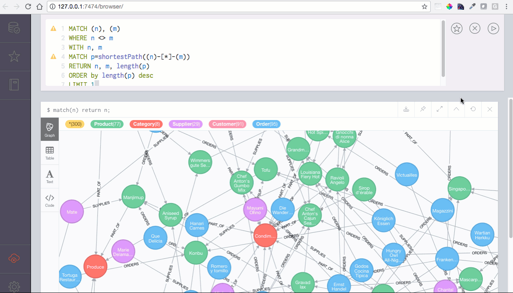
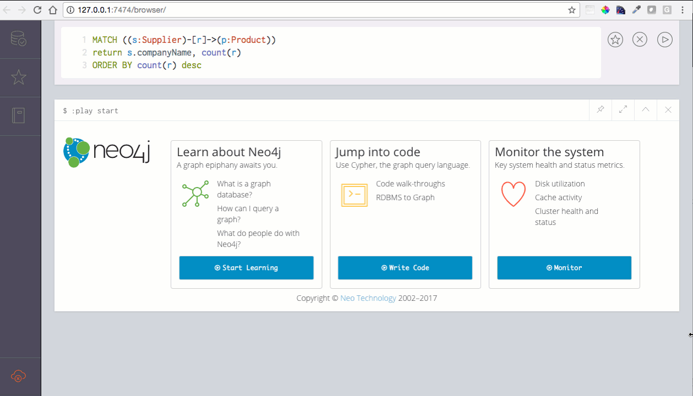

# Creation and Discovery of a Network Database

## Assignment

1.  Load a graph database of your choosing from a text file or other source.  If you take a large network dataset from the web (such as fromhttps://snap.stanford.edu/data/), please feel free at this point to load just a small subset of the nodes and edges.
2.  Create basic analysis on the graph, including the graph’s diameter, and at least one other metric of your choosing.  You may either code the functions by hand (to build your intuition and insight), or use functions in an existing package. 
3.  Use a visualization tool of your choice (Neo4j, Gephi, etc.) to display information.
4.  Please record a short video (~ 5 minutes), and submit a link to the video in advance of our meet-up.

## Plan

We'll take the Neo4j version of the Northwind database, creating it in a Neo4j database, visualize it, analyze it, then chat about it!

## Setting up a Neo4j database

After installing Neo4j, it's important to know where the default home for your databases are.  In my case, I use a Mac, so the [Neo4j documentation](https://neo4j.com/docs/operations-manual/current/configuration/file-locations/) tells me that my home drive is in /Documents/Neo4j.

Using that path, I can then use a command line interface to run my entire Cypher script, using the Neo4j shell.  The `-path` parameter tells Neo4j which database to use, and the `-file` parameter tells Neo4j what to execute there.  In my case the command is like this (it'll be different for you based on what directory you issue this command from and whether you need fully qualified paths):

`neo4j-shell -path Documents/Neo4j/default.graphdb/ -file northwind.cypher`

The output in the command line interface should look something like this:

    +-------------------+
    | No data returned. |
    +-------------------+
    Nodes created: 77
    Properties set: 1155
    Labels added: 77
    1677 ms
    +-------------------+
    | No data returned. |
    +-------------------+
    Nodes created: 8
    Properties set: 32
    Labels added: 8
    143 ms
    +-------------------+
    | No data returned. |
    +-------------------+
    Nodes created: 29
    Properties set: 348
    Labels added: 29
    160 ms
    +-------------------+
    | No data returned. |
    +-------------------+
    Nodes created: 91
    Properties set: 1001
    Labels added: 91
    72 ms
    +-------------------+
    | No data returned. |
    +-------------------+
    Nodes created: 830
    Properties set: 11620
    Labels added: 830
    382 ms
    +-------------------+
    | No data returned. |
    +-------------------+
    <Nothing happened>39 ms
    +-------------------+
    | No data returned. |
    +-------------------+
    <Nothing happened>3 ms
    +-------------------+
    | No data returned. |
    +-------------------+
    <Nothing happened>4 ms
    +-------------------+
    | No data returned. |
    +-------------------+
    <Nothing happened>3 ms
    +-------------------+
    | No data returned. |
    +-------------------+
    <Nothing happened>2 ms
    +-------------------+
    | No data returned. |
    +-------------------+
    Relationships created: 77
    304 ms
    +-------------------+
    | No data returned. |
    +-------------------+
    Relationships created: 77
    61 ms
    +--------------------------------------------+
    | No data returned, and nothing was changed. |
    +--------------------------------------------+
    44 ms
    +-------------------+
    | No data returned. |
    +-------------------+
    Relationships created: 2155
    Properties set: 12930
    4021 ms

## Looking at my Neo4j database

If I've already started any Neo4j browsers, I can close those browser windows.  If I started the Neo4j server via command line, I can issue `neo4j stop` to stop the server.  I'll want to open a fresh session on port 7474 in my database.

I double-click on the Neo4j icon, and navigate to the default.graphdb database using the file browser.  I open it and start the server, which allows me to open a browser window.  In the Neo4j browser, I can query and look at my graph!

## Measuring metrics

### Graph Diameter

Graph diameter is the longest example of the most efficient path traversal to get from one node to another.  So, in the Neo4j browser, this is what we'll do:

- Select all combinations of two different nodes (of any type, we can call them m and n)
- For each combination, find the shortest possible path (of any kind -- supply edges, order edges -- and any direction or combination of directions)
- Sort those by the length of the shortest possible path
- Find the maximum of those lengths

Or, in code:

    MATCH (n), (m)
    WHERE n <> m
    WITH n, m
    MATCH p=shortestPath((n)-[*]-(m))
    RETURN n, m, length(p)
    ORDER by length(p) desc
    LIMIT 1

Note that there might be a tie (and in fact, in our case, there are many path traversals with the same length).  This is what that search looks like (but note, it takes longer than the animation suggests!)

In our case, the diameter of the graph (longest path length _p_) is 6, and an example (of several possible) is the path length between the Category "Grains/Cereals" and the Order 10441 from Old World Delicatessen.  What does that path look like?

### Showing a Path

We find out what the path between the Category "Grains/Cereals" and the Order 10441 from Old World Delicatessen looks like by describing a path between the nodes we're interested in:

    MATCH path=shortestPath((grains:Category {categoryName:"Grains/Cereals"})-[*]-(alaska_order:Order {orderID:"10441"}))
    RETURN path

We can see that the path is indeed pretty darn circuitous, and passes through 3 orders, 3 products, and 1 category in order to connect Grains/Cereals and Old World Delicatessen's Order #10441. 

What if we wanted to find out something a bit less artificial, say, which suppliers gave us the most products?

### Finding Important Suppliers

We want to find the suppliers which we use for multiple products, maybe because we realize that they're popular with our consumers and we might want to leverage our relationship with them.

To do this, we want to describe and count the relationship we're interested in:

We're looking for the number of relationships between Suppliers and distinct Products.  Here's one way to do it, which specifies the end nodes (Supplier and Product).  We know there's only one kind of relationship between these node types, so we don't have to specify it -- we can just let it have a variable name _r_.  What do we want back?  A list of Supplier names and the number of products they supply, in descending order.

    MATCH ((s:Supplier)-[r]->(p:Product))
    return s.companyName, count(r) 
    ORDER BY count(r) desc

Let's take a peek at what that looks like!

## Want More?

I made a [15-minute video](https://youtu.be/Am-EuBaDv0g) showing all this, as well as a [quick 5-minute overview](https://youtu.be/RWLY1n5jN20).  Check them out!
